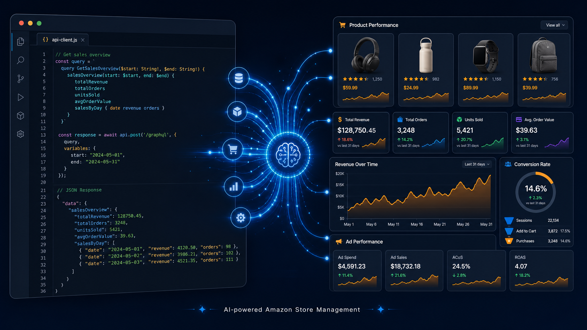
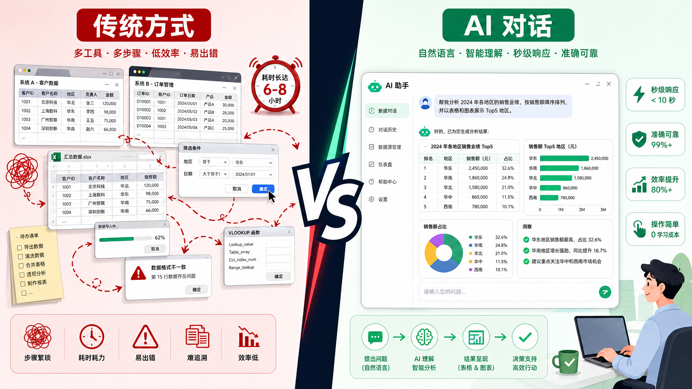
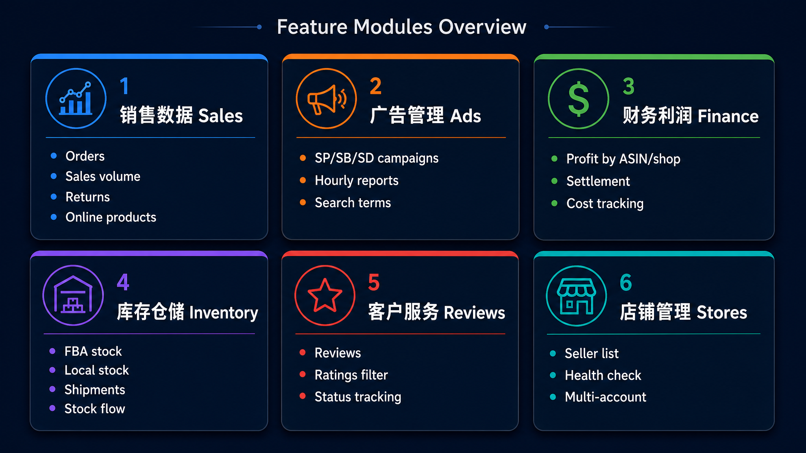
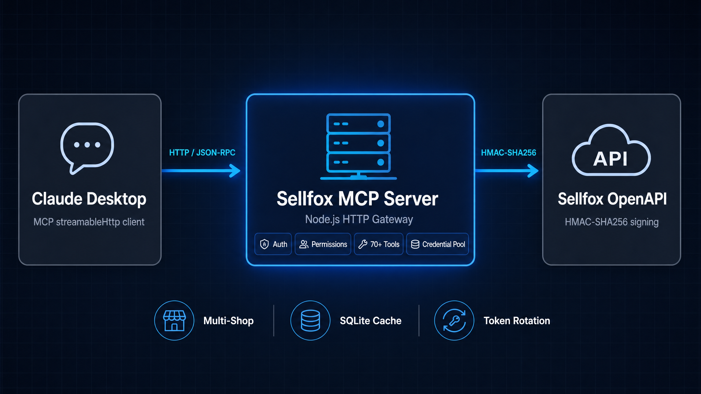
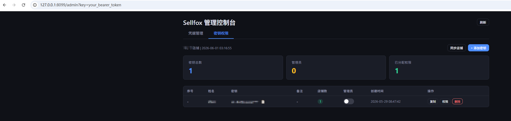
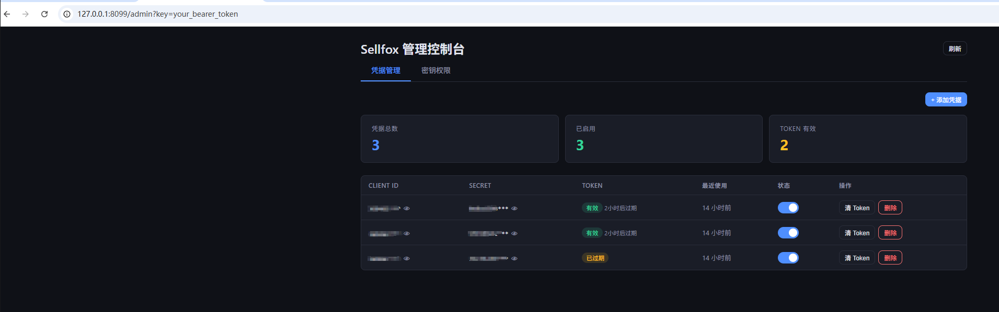
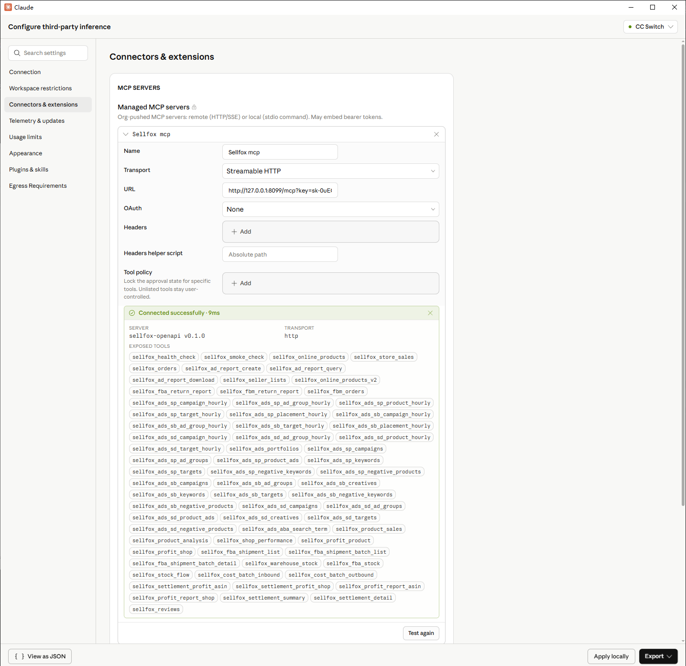
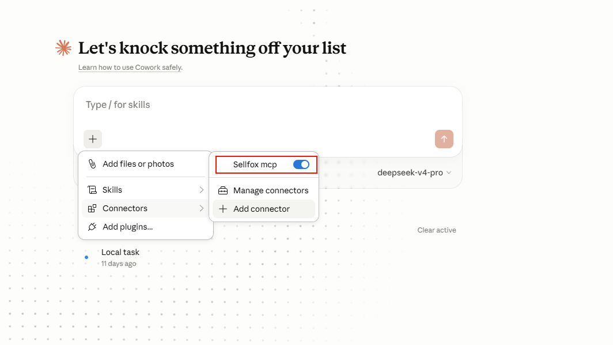

# Sellfox MCP — 赛狐 MCP 用 AI 助手管理亚马逊店铺

<p align="center">
  <br>
  <em>用自然语言对话，替代手工翻页查数据 — 让 AI 成为你的亚马逊运营副驾驶</em>
</p>

---

<!-- 配图：封面图，展示 Claude Code 对话界面与 Sellfox 数据交互的效果示意图 -->


---

## 为什么你需要这个工具？

做亚马逊的你，每天是不是这样：

- 打开赛狐后台 → 切换到广告报表 → 选店铺、选时间、等加载 → 导出 CSV → 打开 Excel → 做数据透视 → 发现问题 → 再回到后台调广告
- 想看某个 ASIN 的利润？又要切到财务模块 → 选店铺 → 搜 ASIN → 等加载 → 复制数据
- 想知道哪个产品退货率高？切换到 FBA 退货报告 → 筛选 → 排序 → 一个一个查
- 十几个店铺，每个都要重复一遍

**这些操作的本质，都是在"翻译"——把你的业务问题翻译成鼠标点击和菜单选择。**

那如果，有一个助手能直接听懂你的问题呢？

> "帮我对比上周所有店铺的 SP 广告 ACOS，找出花费超过 $50 但转化率低于 5% 的广告组。"
>
> "把最近三个月退货率最高的 10 个 ASIN 列出来，附带他们的利润数据。"
>
> "我今天所有店铺的销量汇总，跟昨天对比一下。"

**这就是 Sellfox MCP 要做的事。**

<!-- 配图：对比图，左侧是传统的多页面操作流程，右侧是一句话对话搞定 -->


---

## AI 时代：跨境卖家的机遇与挑战

### 你正在面对的

- **数据分散** — 订单、广告、库存、利润、评价……每个数据住在不同页面，想交叉分析？导出 Excel 慢慢 VLOOKUP
- **重复劳动** — 每天早上一杯咖啡，打开 8 个页面，点 40 次鼠标，拉 6 份报表——这是运营的"晨间仪式"
- **决策靠经验** — 数据在系统里，但提取太慢。最后变成"我感觉这个品该加预算了"
- **人效瓶颈** — 一个熟练运营管 3-5 个店铺基本饱和，扩店就得加人

### AI 带来的改变

2024 年开始，大语言模型（LLM）真正进入了实用阶段。Claude、GPT 这些模型不只是"聊天机器人"，它们能**调用工具、分析数据、生成报告**。

MCP（Model Context Protocol）是一种开放协议，让 AI 助手能够安全地连接你的业务系统——就像给 AI 装上了"手和眼睛"。

**这意味着什么？**

- **从"人找数据"变成"数据找人"** — 你不用去各个页面翻数据，AI 自动帮你汇总分析
- **从"经验驱动"变成"数据驱动"** — 每个决策都能快速用数据验证，不用再拍脑袋
- **从"一个人管 5 个店"变成"一个人管 20 个店"** — 重复操作交给 AI，你专注策略
- **24 小时在线** — 睡前问一句"今天广告花了多少，有没有异常的"，秒回

### 但工具不是魔法

坦诚地说，AI 不会替你选品、不会替你定价、不会替你理解你的品类。它能做的，是**把你从数据搬运工解放出来，让你回归卖家的核心价值——产品和策略**。

<!-- 配图：AI 赋能卖家的示意图，展示从数据搬运到策略决策的转变 -->


---

## Sellfox MCP 是什么？

**一句话：把你的赛狐（Sellfox）亚马逊后台数据，接入 AI 助手。**

它基于 MCP 协议，封装了赛狐 OpenAPI 的 70+ 个数据接口，覆盖：

| 模块 | 能做什么 | 接口数 |
|------|---------|--------|
| 销售数据 | 销量、订单、退货、在线产品 | 7 |
| 广告管理 | SP/SB/SD 广告数据、小时报告、搜索词 | 35+ |
| 财务利润 | 结算利润、成本、利润报表（ASIN/店铺维度） | 8 |
| 库存仓储 | FBA 库存、本地库存、库存流水、发货单 | 6 |
| 客户服务 | 评价明细、星级过滤、评论状态追踪 | 1 |
| 店铺管理 | 授权店铺列表、健康检查 | 2 |

<!-- 配图：功能模块总览图 -->


---

## 使用方式

Sellfox MCP 提供三种使用方式：接入 Claude 桌面端用对话操作（推荐新手）、命令行一键拉数据（推荐开发/自动化）、或通过 API Key 分享给团队成员。

---

### 架构概览

整体部署架构非常简单，只需要一台机器运行 MCP 服务，其他客户端通过 MCP 协议连接：

```
┌─────────────────────┐
│  Claude 桌面端       │  ← 你的电脑（日常使用）
│  (MCP streamableHttp)│
└────────┬────────────┘
         │ HTTP
         ▼
┌─────────────────────┐
│  Sellfox MCP 服务    │  ← 部署在服务器 / 本机
│  (Node.js HTTP 网关) │
└────────┬────────────┘
         │ HMAC-SHA256
         ▼
┌─────────────────────┐
│  赛狐 OpenAPI        │
└─────────────────────┘
```



---

### Step 1：部署 MCP 服务

#### 环境要求

- **Node.js 22+**（需要 `node:sqlite` 实验性支持）
- **赛狐 OpenAPI 账号**（联系赛狐商务开通，获取 `client_id` 和 `client_secret`）

#### 下载与启动

```bash
# 1. 克隆项目
git clone <your-repo-url> sellfox-mcp-node
cd sellfox-mcp-node

# 2. 安装依赖
npm install
npm run build

# 3. 创建环境变量配置
cp .env.example .env
```

编辑 `.env` 文件，填入你的赛狐认证信息：

```env
# 赛狐 OpenAPI 认证信息（必填）
SELLFOX_CLIENT_ID=你的client_id
SELLFOX_CLIENT_SECRET=你的client_secret

# 管理员 Token（首次启动时设置，用于创建 API Key）
SELLFOX_BOOTSTRAP_TOKEN=你的管理员token

# 以下为可选配置
# SELLFOX_CREDENTIAL_DB=./runtime/credentials.db   # 多账号凭据池
```

启动 HTTP 服务：

```bash
# 开发模式（推荐）
npm run dev:http

# 生产模式
npm run build && npm run start:http
```

服务默认运行在 `http://localhost:3100`。启动后访问 `http://localhost:3100/console` 打开管理后台。

<!-- 配图：管理后台截图 -->


#### 创建 API Key

在管理后台中创建 API Key，用于 Claude 桌面端连接：

1. 打开 `http://localhost:3100/console`
2. 进入「API Key 管理」
3. 点击「创建 Key」，设置名称和店铺权限
4. 复制生成的 Key（格式：`sk-xxx`）

<!-- 配图：创建 API Key 操作截图 -->


---

### Step 2：配置 Claude 桌面端

> Claude 桌面端（Claude Desktop）是 Anthropic 官方推出的桌面应用，支持通过 MCP 协议接入外部工具。

#### 找到配置文件

根据你的操作系统，Claude 桌面端的配置文件位于：

- **Windows**：`%APPDATA%\Claude\claude_desktop_config.json`
- **macOS**：`~/Library/Application Support/Claude/claude_desktop_config.json`

用文本编辑器打开这个文件（如果不存在则新建），添加 MCP 服务配置：

```json
{
  "mcpServers": {
    "Sellfox MCP": {
      "type": "streamableHttp",
      "url": "http://127.0.0.1:3100/mcp?key=你的API_KEY",
      "name": "Sellfox MCP",
      "description": "Sellfox 跨境电商平台数据服务。连接赛狐 OpenAPI，支持查询亚马逊店铺销量、订单、广告、利润、库存和评价数据。"
    }
  }
}
```

> 如果你把 MCP 服务部署到了服务器上，把 `127.0.0.1:3100` 换成服务器的 IP 和端口即可。

**保存配置文件后，完全退出并重启 Claude 桌面端。**

<!-- 配图：Claude 桌面端配置文件编辑截图 -->


---

### Step 3：开始使用

重启后，Claude 桌面端会自动连接 Sellfox MCP。你可以直接在对话中提问：

```
帮我看看有哪些店铺

查一下最近7天所有店铺的销量汇总

对比上周和这周的广告花费，按店铺列出

哪个 ASIN 退货率最高？帮我看下它的评价内容

分析一下我 SP 广告中 ACOS 超过 30% 的关键词，给出优化建议

上个月哪个店铺的净利润最高？列出 Top 10 产品的利润率
```

<!-- 配图：Claude 桌面端对话示例截图 -->


---

### 进阶：团队共享

同一个 MCP 服务可以创建多个 API Key，分给团队不同成员使用。在管理后台为每个成员创建独立的 Key，并可以限制每个 Key 只能访问指定店铺，实现权限隔离。

---

### 命令行 CLI（无需 Claude，终端直连）

如果你不想装 Claude 桌面端，或者想在脚本/定时任务里自动拉数据，可以直接在终端里用命令行。

**一句话解释：把上面的 MCP 工具名当成命令敲，加参数就行。**

#### 起步（30 秒）

```bash
# 1. 安装依赖并编译
npm install && npm run build

# 2. 配好 .env（和 HTTP 模式一样，填 SELLFOX_CLIENT_ID 和 SELLFOX_CLIENT_SECRET）
cp .env.example .env

# 3. 链接到全局，之后就能直接用 sellfox 命令了
npm link

# 看所有可用命令
sellfox --help

# 看某个命令怎么用
sellfox --help orders
```

#### 关于凭证和权限

CLI 需要赛狐 API 凭证才能用，配在 `.env` 里：

```env
SELLFOX_CLIENT_ID=你的client_id
SELLFOX_CLIENT_SECRET=你的client_secret
```

没有凭证就跑会直接报错 `缺少环境变量`。

> **注意：CLI 模式目前不支持权限控制。** 有凭证就能访问该账号下所有店铺数据。如果需要限制每个成员只能看指定店铺，请用上面的 HTTP 模式（API Key + 店铺权限隔离）。

#### 常用命令（直接复制改参数）

```bash
# 看看有哪些店铺
sellfox seller-lists --pretty

# 查最近 7 天订单
sellfox orders --dateStart "2026-06-01 00:00:00" --dateEnd "2026-06-07 23:59:59" --pretty

# 查产品销量（按 ASIN 汇总）
sellfox store-sales --startDate 2026-06-01 --endDate 2026-06-07 --groupType asin --pretty

# 查最近一周差评
sellfox sellfox_reviews --startDate 2026-06-01 --endDate 2026-06-07 --starList 1,2 --pretty

# 创建广告报告
sellfox ad-report-create --shopIds 123456 --adTypeCode sp --reportTypeCode adCampaignReport --timeUnit daily --reportStartDate 2026-06-01 --reportEndDate 2026-06-07 --pretty

# 查利润（ASIN 维度）
sellfox sellfox_profit_product --startDate 2026-06-01 --endDate 2026-06-07 --pretty

# 查 FBA 库存
sellfox sellfox_fba_stock --pretty

# 查 SP 广告活动数据
sellfox sellfox_ads_sp_campaigns --shopIds 123456 --pretty
```

#### 参数规则（一看就懂）

```
--key value         字符串参数
--key 1,2,3         数组参数（逗号分隔）
--flag              布尔开关（出现就是 true）
--pretty            格式化输出，方便人眼阅读
```

**输出都是 JSON**，可以 pipe 给 `jq` 或其他脚本做二次处理：

```bash
sellfox seller-lists | jq ".data[].shopName"
```

#### 开发模式（不编译直接跑）

```bash
npx tsx src/cli.ts seller-lists --pretty
```

#### 构建后使用

```bash
npm run build
npm link          # 链接到全局，之后直接敲 sellfox
sellfox seller-lists --pretty
```

---

## 详细功能说明

### 1. 销售与订单

| 工具名称 | 功能说明 |
|---------|---------|
| `sellfox_online_products` | 在线产品查询（Listing/SKU 维度） |
| `sellfox_online_products_v2` | 在线产品 V2，支持更多搜索字段 |
| `sellfox_store_sales` | 产品销量（支持日/周/月汇总） |
| `sellfox_product_sales` | 产品销量 V2，支持 ASIN/MSKU/SKU 维度 |
| `sellfox_orders` | 订单列表（时间/店铺/状态/发货方式筛选） |
| `sellfox_fbm_orders` | FBM 订单列表 |
| `sellfox_fba_return_report` | FBA 退货报告 |
| `sellfox_fbm_return_report` | FBM 退货报告 |

**典型用法：**

> "查询最近 30 天所有店铺销量 Top 20 的 ASIN"
>
> "列出所有待发货的 FBM 订单"
>
> "上周退货的 FBA 产品有哪些，按退货数量排序"

### 2. 广告分析

#### 广告基础数据（19 个接口）
覆盖 SP / SB / SD 三种广告类型的活动、广告组、产品、关键词、投放目标、否定关键词等基础数据。

#### 小时维度报告（13 个接口）
SP/SB/SD 广告的小时级数据报告，包括活动、广告组、产品、投放、广告位等维度。

#### 自定义广告报告
| 工具名称 | 功能说明 |
|---------|---------|
| `sellfox_ad_report_create` | 创建广告下载任务 |
| `sellfox_ad_report_query` | 查询报告生成进度 |
| `sellfox_ad_report_download` | 下载并解析报告数据 |
| `sellfox_ads_aba_search_term` | ABA 搜索词报告 |

**典型用法：**

> "所有 SP 广告中，哪些关键词的 ACOS 超过 50%？"
>
> "对比 SB 和 SD 广告的转化率，分店铺展示"
>
> "昨天的广告小时报告，看看哪个时段转化最好"
>
> "拉取最近 7 天的搜索词报告，找出高点击低转化的词"


### 3. 财务与利润

| 工具名称 | 功能说明 |
|---------|---------|
| `sellfox_profit_product` | 产品维度利润 |
| `sellfox_profit_shop` | 店铺维度利润 |
| `sellfox_settlement_profit_asin` | 结算利润（ASIN 维度） |
| `sellfox_settlement_profit_shop` | 结算利润（店铺维度） |
| `sellfox_profit_report_asin` | 月度利润报表（ASIN） |
| `sellfox_profit_report_shop` | 月度利润报表（店铺） |
| `sellfox_settlement_summary` | 结算汇总 |
| `sellfox_settlement_detail` | 结算明细 |
| `sellfox_cost_batch_inbound` | 入库成本 |
| `sellfox_cost_batch_outbound` | 出库成本 |

**典型用法：**

> "上个月每个店铺的净利润是多少？"
>
> "帮我算一下 Top 10 销量 ASIN 的真实利润率（扣除广告和 FBA 费用）"
>
> "哪些产品的利润率低于 10%？列出并排序"

### 4. 库存与 FBA

| 工具名称 | 功能说明 |
|---------|---------|
| `sellfox_warehouse_stock` | 本地库存明细 |
| `sellfox_fba_stock` | FBA 库存明细 |
| `sellfox_stock_flow` | 库存流水（出入库记录） |
| `sellfox_fba_shipment_list` | FBA 发货单列表 |
| `sellfox_fba_shipment_batch_list` | FBA 发货批次列表 |
| `sellfox_fba_shipment_batch_detail` | 发货批次详情 |

**典型用法：**

> "FBA 库存少于 30 天的 ASIN 有哪些？帮我生成补货建议"
>
> "在途的发货批次有哪些，预计什么时候到仓？"
>
> "最近出库成本异常高的产品有哪些？"


### 5. 评价与客服

| 工具名称 | 功能说明 |
|---------|---------|
| `sellfox_reviews` | 评价明细（星级/状态/时间多维度筛选） |

**典型用法：**

> "最近一周有哪些差评？把对应的订单和产品信息列出来"
>
> "对比所有店铺的评分变化趋势"
>
> "找出有差评但还没处理的产品"

### 6. 系统工具

| 工具名称 | 功能说明 |
|---------|---------|
| `sellfox_health_check` | 健康检查（环境变量/Token/连通性） |
| `sellfox_smoke_check` | 烟测（线上产品→订单→销售→评价全链路验证） |
| `sellfox_seller_lists` | 已授权店铺列表 |

---

## 多店铺管理

如果你有多个赛狐账号（比如多套主体），可以通过凭据池管理：

```bash
# 初始化凭据数据库
npx tsx --experimental-sqlite src/server.ts --init-pool

# 添加凭据
npx tsx --experimental-sqlite src/server.ts --add-credential \
  --name "主体A" --client-id "xxx" --client-secret "yyy"
```

然后在 `.env` 中配置数据库路径：

```env
SELLFOX_CREDENTIAL_DB=./runtime/credentials.db
```

系统会自动轮换凭据，避免单个账号的 API 频率限制。

---

## 安全说明

- **数据不出境** — 所有数据请求直接在你的机器和赛福 OpenAPI 之间传输，不经过任何第三方
- **Token 本地存储** — OAuth2 Token 缓存在本地文件或 SQLite 中，不上传
- **店铺级权限** — HTTP 模式下可配置每个 API Key 只能访问指定店铺
- **代码开源可审计** — 所有代码在本地运行，可自行审查

---

## 常见问题

**Q: 需要什么技术背景？**

A: 日常使用**不需要任何编程背景**。部署服务需要几步命令行操作（跟着教程复制粘贴就行），配置 Claude 桌面端只需编辑一个 JSON 文件。一旦配置完成，以后每天使用只需打开 Claude 桌面端用自然语言对话即可。

**Q: 赛狐 OpenAPI 怎么开通？**

A: 联系你的赛狐客户经理，申请开通 OpenAPI 权限，获取 `client_id` 和 `client_secret`。

**Q: 数据安全吗？**

A: 代码完全开源，在你的电脑或服务器上本地运行。数据直接从你的机器到赛狐服务器，不经过任何中间环节。

**Q: 支持哪些亚马逊站点？**

A: 赛狐 OpenAPI 覆盖北美（US/CA/MX）、欧洲（UK/DE/FR/IT/ES 等）、日本、澳洲、中东等全球主要站点。

**Q: 可以同时管理多个赛狐账号吗？**

A: 支持。通过凭据池功能，可以配置多套 `client_id/client_secret`，系统会自动轮换。

**Q: 免费吗？**

A: 本项目开源免费。但使用赛狐 OpenAPI 需要赛狐账号授权（具体费用政策请咨询赛狐官方）。

---

## 开发相关

```bash
npm run dev              # Stdio 开发模式
npm run dev:http         # HTTP 开发模式
npm run dev:cli -- <命令> # CLI 开发模式
npm run build            # 编译 TypeScript
npm start                # 运行编译后的 Stdio 服务
npm run start:http       # 运行编译后的 HTTP 服务
npm run cli -- <命令>     # 运行编译后的 CLI
```

技术栈：TypeScript + Node.js 22 + MCP SDK + Zod v4 + SQLite + 零外部网络依赖

---

## 项目结构

```
src/
├── server.ts          # Stdio MCP 入口
├── http-server.ts     # HTTP 网关入口
├── mcp-server.ts      # MCP 工具注册（70+ 工具）
├── services.ts        # 业务逻辑层
├── client.ts          # 赛狐 OpenAPI 客户端（HMAC 签名/Token/OAuth2）
├── endpoint-specs.ts  # 70+ 接口规格定义
├── credential-pool.ts # 多账号凭据池（SQLite）
├── api-key-manager.ts # API Key 管理
├── auth.ts            # Bearer Token 管理
├── shop-permission.ts # 店铺权限控制
└── admin-page.ts      # 管理后台页面
```

---

## 协议

MIT License

---

<p align="center">
  <br>
  <em>让 AI 替你搬数据，你只管做决策</em>
</p>
